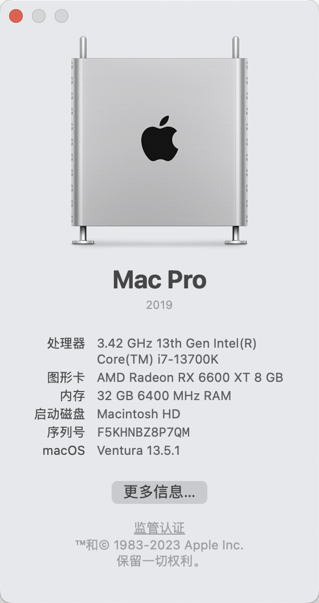

# Z790M-AORUS-ELITE-I7-13700k-OpenCore-Hackintosh
技嘉Z790M i7 13700k 黑苹果 OpenCore  Config

||品牌型号|价格|
|-|-|-|
|主板CPU套装| i7 13700k 盒装 && 技嘉 z790m|3734|
|散热器|酷里奥P60T|269|
|机箱|九州风神CH370|280|
|鼠标|妙控板3代|672|
|显示器|HKC 27 4K P272U Pro|1289|
|硬盘|雷克沙 ARES  PCIE 4.0 4T|1094|
|显卡|讯景 6600xt (二手)|1100|
|键盘|宏基 客制化  三模 64键|153|
|内存|威刚威龙 DDR5 16*2|672|
|电源|美商艾派GTR 850|699|
|网卡|奋威 T919|190|
|音箱|联想 有线|49|
||总价格|10201|

